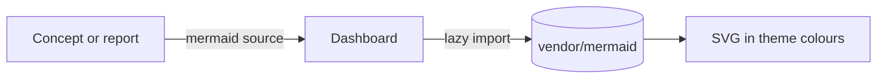

The [OKF spec](/references/okf-spec.md) is ground truth
([decision](/decisions/okf-ground-truth.md)). These conventions only choose
among what OKF allows.

# Actors

- Humans: `human:<id>` (e.g. `human:lachlan`), configured in `rdstudio.toml`.
- Agents: `<harness>/<model>` (e.g. `claude-code/claude-opus-5-5`).
- Tools: `process:rdstudio`.

# Provenance and verification

- `generated: { by, at }` is updated on every **significant** edit, since OKF
  defines `generated.at` as the last meaningful change. Minor edits (typos,
  dictated one-line additions) leave it unchanged. When an agent does not say,
  the [classifier](/decisions/classifier-optional.md) judges from the change.
- `verified` is appended to by humans (`rdstudio verify <path>`).
- A human verification whose latest `at` precedes `generated.at` is shown as
  **stale** in the Review tab ([decision](/decisions/verification-staleness.md)).
- When a person accepts text a model proposed in the editor
  ([an agent in the editor](/design/assist.md)), `by` names the model beside
  them: `human:<id> with openrouter/<model>`. The edit is otherwise theirs:
  `at` moves only if the edit is significant.

# Concept types (starting vocabulary)

`Overview`, `Design`, `Decision`, `Question`, `Task`, `Roadmap`,
`Procedure`, `Reference`, `Research`, `Experiment`, `Idea`, `Policy`.
Unknown types are always tolerated.

# Tasks

`type: Task`, with state carried in `tags` (`todo`, `active`, `done`,
`dropped`) plus a milestone tag. Body sections: `# Prompt`, `# Plan`,
`# Acceptance`, `# Outcome` (outcome links to the HTML report, if any).

# Decisions and questions

`type: Decision` with sections `# Decision`, `# Assumption`, `# Reopen if`.
`type: Question` with `# Question` and, once answered, `# Answer`
(`tags: [open]` or `[answered]`).

# Reports

HTML files in `reports/`, outside the bundle
([decision](/decisions/reports-html.md)). Metadata in the document head:

```html
<meta name="rdstudio:type" content="Report">
<meta name="rdstudio:date" content="2026-09-23">
<meta name="rdstudio:author" content="claude-code/claude-opus-5-5">
```

Links into knowledge use `/knowledge/<path>.md`; they become one-way graph edges.

# Procedures

`type: Procedure` concepts carry a procedural graph in frontmatter
([decision](/decisions/procedural-graphs.md)):

```yaml
start: add                      # optional; default is the first node
nodes:
  - { id: add, label: papis add by DOI }
  - { id: rename, label: Rename citekey }
edges:
  - from: add
    to: rename
    relation: LEADS_TO          # LEADS_TO | TRIGGERS | PROVIDES_INPUT_FOR | CONVERGES_TO
    condition: entry was created
    guidance: follow author2020short convention
    pitfalls: papis auto-generates a non-conforming key
proposals:                      # written by procedure_propose; resolved by the developer
  - { id: 1, by: <agent>, at: <time>, state: pending, rationale: ..., edits: [...] }
```

Agents follow a procedure with `procedure_next` (the current step and what can
follow within two transitions) and suggest changes with `procedure_propose`.
The developer applies or rejects them with `rdstudio procedure apply|reject`;
rejected proposals stay as a record.

# Diagrams

Diagrams are Mermaid text, so people and agents can both read and edit them
and diffs show what changed:

- in concepts, a fenced block: ` ```mermaid ` … ` ``` ` (plain markdown, so the
  bundle stays OKF-conformant; other viewers show the source, GitHub draws it);
- in reports, `<pre class="mermaid">…</pre>`.

The dashboard and reports draw them offline with the vendored Mermaid ESM
build, loaded only on pages that contain a diagram and coloured from the active
theme. A diagram that fails to parse shows the error and its source.



# Link ratings

A link's Markdown title rates how consequential it is:
`[tangent space](/manifolds/tangent/tangent-space.md "requires")`. This is plain
CommonMark, so it stays valid OKF and works for any subject.

| Rating | Meaning |
|---|---|
| `requires` | a prerequisite: this concept cannot be understood without that one |
| `uses` | relied on in a key fact, example or proof, but not needed to define it |
| `see also` | a forward reference (it builds on this concept) or a tangent |

Unrated links count as `uses`. Direction matters: A `requires` B means B comes
first. "requires" links form a prerequisite graph: the map hides links implied
by chains of others (a transitive reduction), and `rdstudio check` warns about
groups of concepts that require each other, which the Review tab lists.
They also give a reading order, each note's study path (everything it
requires, in order) and its level (the longest chain of prerequisites below
it), shown in the Learn tab, on note pages and on the map, and by
`rdstudio path`. A study path is only as good as the requires links: a note
that uses a concept without linking to it looks like a starting point.
