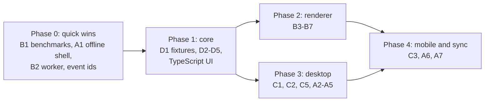

# Why

The dashboard is slow in two places, neither of which needs a native rewrite
to fix:

1. **Everything goes over the network.** Each view is fetched from
   `rdstudio serve` at home, so a slow tunnel makes every screen slow. Gzip and
   caching halved load times on a slow link, but every screen still waits on
   the network.
2. **The map is SVG.** Thousands of elements with filters are redrawn on every
   zoom step; phones struggle, most of all with the Space theme.

The priority is performance and deployment first, then more features
([M8](/design/understanding-layer.md) resumes afterwards).

# Target architecture

```mermaid
flowchart LR
    subgraph core["Core (Rust)"]
        okf[OKF parse and lint] --- graph[graph: requires, order, implied links]
        graph --- search[BM25 search]
        search --- rec[learner record merge]
    end
    core -->|WASM| web["Web UI (TypeScript)<br/>browser, PWA"]
    core -->|native| tauri["Tauri app<br/>desktop, Android, iOS"]
    core -->|PyO3| py["Python package<br/>CLI, MCP, papis"]
    tauri --- web
    sync[(git remote or<br/>sync server)] <--> tauri
    sync <--> web
```

One core, three bindings; one UI, three shells (browser, Tauri, static
export). The OKF spec plus a shared set of test bundles is the contract that
keeps implementations in step.

# A. Local-first data

The device holds the bundle and the learner record; the network is for sync,
not for every screen.

| # | Feature | Notes |
|---|---|---|
| A1 | **Offline app shell** | A service worker caches the app and data; reloads are instant and reading works offline. Works with today's server. |
| A2 | **Delta updates** | A manifest of `{path: hash}`; the client fetches only changed files instead of the whole `concepts.json`. |
| A3 | **Derivation on the device** | With the core in WASM, the client needs only the Markdown files and computes concepts, links, order and search itself. The server becomes a file host. |
| A4 | **Sync backends** | git (the bundle is already a repository: libgit2 or gitoxide in Tauri, isomorphic-git in the browser); `rdstudio serve` as a sync endpoint at home; a hosted service later. |
| A5 | **Learner record sync** | Events are only ever appended, so merging devices is a union. Each event needs a unique id (device id plus a sortable timestamp) before any sync exists; add it now to avoid a migration. End-to-end encryption for any hosted sync. |
| A6 | **Edits from devices** | Three-way merge of note text, with a conflict view. Depends on [editing](/tasks/T30-dashboard-editing.md). |
| A7 | **Several projects per device** | A project switcher; each project is a bundle plus a record. |

# B. GPU map rendering

| # | Feature | Notes |
|---|---|---|
| B1 | **Benchmarks first** | Frame times while panning and zooming, and time to first map, under CPU throttling, on the differential geometry bundle and on generated bundles of 1,000 and 5,000 notes. At 63 notes the cost is filters and redraws; at 5,000 it is layout and routing. |
| B2 | **Layout and routing in a Web Worker** | Moves the heavy work off the main thread; results cached by bundle hash and settings, so a reload does not recompute. No renderer change needed. |
| B3 | **A renderer interface** | Separate "what to draw" (regions, routes, places, badges, labels) from "how", so SVG, Canvas 2D and WebGL can be swapped and compared. |
| B4 | **WebGL renderer** | PixiJS (WebGL, with WebGPU where available) for regions, routes and markers. Labels, badges and tooltips stay in a thin DOM overlay: the label budget keeps them few. Try Canvas 2D first behind the same interface; it may be enough at this scale. |
| B5 | **Theme parity** | Each theme's map tokens become renderer parameters; the pencil (`#m-sketch`) and nebula (`#m-soft`) filters become shaders or pre-rendered textures; direction gradients become per-vertex colours. |
| B6 | **Interaction and accessibility** | Hit-testing with a quadtree; hover, focus, study paths. A canvas has no DOM semantics, so keep an off-screen list of places for keyboards and screen readers. |
| B7 | **Level of detail** | Draw only what is on screen; folders only when zoomed out; route what is visible first. |
| B8 | **Graph view** | The same renderer, later. |

# C. Tauri app

| # | Feature | Notes |
|---|---|---|
| C1 | **Desktop shell** | Tauri 2 with the web UI bundled, no server. Rust commands for opening a project, reading and writing files, watching for changes, git. |
| C2 | **Core linked natively** | Calls the Rust core directly. |
| C3 | **Mobile** | Android first (the developer's phone), then iOS. Projects arrive by git clone or from the home sync endpoint. iOS distribution needs an Apple developer account. |
| C4 | **Agents** | The MCP server as a single binary (the Rust MCP SDK) or the existing Python one; harnesses launch it as now. |
| C5 | **Distribution** | GitHub Releases built in CI; the Tauri updater with signed updates; AppImage, deb and Flatpak for Linux; macOS notarisation; an APK, then Play Store or F-Droid. |
| C6 | **The web stays** | The same UI served by `rdstudio serve`, a static export or a hosted service. |

# D. Core rewrite

**Rust for the core, TypeScript for the UI.** Rust compiles to WASM for the
browser, links natively into Tauri, and binds to Python through PyO3, so the
CLI, MCP server and papis integration keep working while their internals move.
One implementation instead of two that drift. (A TypeScript core would run in
the browser and Tauri too, but the Python side would need a second
implementation.) Learning both languages doubles as an
[alpha trial](/ideas/learning/alpha-trials.md).

| # | Feature | Notes |
|---|---|---|
| D1 | **Conformance fixtures** | Test bundles with the Python core's output recorded as expected JSON: concepts, links and ratings, lint, index files, reading order, search results. Every implementation must match. Also a useful OKF test suite. |
| D2 | **OKF parsing and lint** | Frontmatter (a maintained YAML crate), links through a CommonMark parser rather than regular expressions, headings and sections, trust and staleness, lint, `index.md` generation. |
| D3 | **Graph** | Requires graph, cycles, reading order, depth, study paths, implied links and PageRank (the last two now live in the map's JavaScript). |
| D4 | **Search and learner record** | BM25; record read, append and merge. |
| D5 | **Bindings** | WASM (with TypeScript types), PyO3 (the Python package calls the core), native for Tauri. |
| D6 | **Writes** | Store and verify with provenance; the significance rules. |
| D7 | **Map geometry** | Layout and routing in Rust compiled to WASM, if B1 shows the worker is not enough. |

Stays in Python: papis references, reports scanning, and anything tied to the
Python ecosystem. Git history moves to Tauri's git library when needed.

**The UI moves to TypeScript with a build step** (Vite). This ends
"no build step" but not "no CDN": the build runs at release time and its
output is shipped, vendored, inside the package.

# Order of work



Phase 0 improves today's app without a rewrite and gives the numbers that
decide how far phase 2 must go. Phase 1 is the long one; the Python package
keeps shipping throughout.

# Decisions this makes

- A build step for the UI (TypeScript), still with no CDN at runtime.
- Rust as the source of truth for OKF logic once D1 to D5 pass; the Python
  implementation is retired module by module behind the same API.
- Learner events get unique ids now, before any sync exists.
