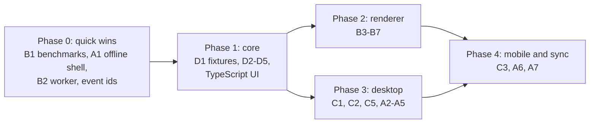

# Why

The dashboard is slow in two places, neither of which needs a native rewrite
to fix:

1. **Everything goes over the network.** Each view is fetched from
   `rdstudio serve` at home, so a slow tunnel makes every screen slow. Gzip and
   caching halved load times on a slow link, but every screen still waits on
   the network.
2. **The map is SVG.** Thousands of elements with filters are redrawn on every
   zoom step; phones struggle, most of all with the Space theme.

The priority is performance and deployment first, then more features
([M8](/design/understanding-layer.md) resumes afterwards).

# Target architecture

```mermaid
flowchart LR
    subgraph core["Core (TypeScript, @rdstudio/core)"]
        okf[OKF parse and lint] --- graph[graph: requires, order, implied links]
        graph --- search[BM25 search]
        search --- rec[learner record merge]
    end
    core --> web["Web UI (Svelte)<br/>browser, PWA"]
    core --> cli["Node: CLI, MCP,<br/>rdstudio serve"]
    web --> tauri["Tauri app<br/>desktop, Android, iOS"]
    cli -.->|subprocess| py["Python<br/>papis, classifier"]
    sync[(git remote or<br/>sync server)] <--> tauri
    sync <--> web
```

One core in one language, imported directly by everything; one UI, three
shells (browser, Tauri, static export). The core never touches the file system
itself: it takes files as text, so the same code runs in a browser, in Node and
in the Tauri webview. The OKF spec plus the conformance fixtures is the
contract that keeps the Python core (while it lasts) and the TypeScript core in
step.

# Scale

A body of knowledge is a tree about four layers deep (fields, areas, subjects,
notes) branching six to ten ways, so even a whole field such as mathematics is
roughly 1,300 to 10,000 notes, and a single subject is 50 to 300. The
differential geometry test bed, 63 notes, would be one bubble among many in a
map of mathematics. Targets:

| Size | Example | Target |
|---|---|---|
| Subject, 50 to 300 notes | differential geometry | smooth on a phone: 60 fps panning, first map under a second |
| Field, about 1,300 | all of geometry and topology | usable on a phone; smooth on a desktop |
| Ceiling, about 4,000 | past anything expected | works; may be slower |

At field size the map must behave like nested bubbles: only the open bubble's
contents are laid out in detail, routed and drawn (B7). The same idea may
later join separate projects into one atlas (A7).

The benchmark presets (`bench/synth.py`) follow these sizes: `subject` (2
layers, branching 8), `area` (3, 6), `field` (4, 6) and `ceiling` (4, 8).

# Stack

| Layer | Choice | Why |
|---|---|---|
| UI | **Svelte 5 and TypeScript, in SvelteKit as a single-page app** (`adapter-static`, no server rendering) | Compiles to small, fast JavaScript with no virtual DOM; one build runs from `rdstudio serve`, a static export and inside Tauri (its documented setup). |
| UI state | Svelte runes (`$state`, `$derived`) for local state; **TanStack Query** where data is genuinely remote (sync status, a hosted service, AI calls) | Most state here is on the device, which runes handle without a cache layer. |
| Core | **TypeScript** (`packages/core`): `yaml` for frontmatter (YAML 1.2), `markdown-it` for links and headings (CommonMark, and the parser the dashboard already renders with) | Runs unchanged in the browser, Node and Tauri; one language for the whole project, which the developer is learning anyway. Fast enough at the target scale (the Python core already builds 3,885 notes in 0.9 s). |
| Command line, MCP, server | **Node** (`packages/cli`): the official MCP TypeScript SDK; `rdstudio serve` on Hono | Replace the Python internals. Installed as now with `uv tool install rdstudio` (see Installing), and also through npm. |
| Data shapes | **zod** schemas in the core, TypeScript types inferred from them | The pydantic role: validation and types from one definition. |
| HTTP API | Hono with `@hono/zod-openapi` producing OpenAPI, from which **HeyAPI** generates the client (`npm run generate`) | The developer's usual workflow, for the parts that really are HTTP: the learner record and writes through `rdstudio serve`, and a hosted service later. Everything else imports the core directly. |
| Python | Stays for papis and the classifier, called as a subprocess (as the classifier already is); the Python CLI and MCP server are retired once the Node ones pass the fixtures | No second implementation to keep in step. |
| Rust | Only Tauri's thin shell, mostly configuration; a hot spot could later move to Rust compiled to WASM, checked by the fixtures | Not needed for speed at this scale. |

**Installing stays one command.** `uv tool install rdstudio` keeps working
when the command line moves to Node: the wheel stays pure Python
(`py3-none-any`) and carries the Node program bundled into one JavaScript file
(esbuild, at release time) beside the built dashboard; the `rdstudio` entry
point is a few lines of Python that run it. Node itself comes as a dependency,
`nodejs-wheel-binaries` (Node 24 for Linux, macOS and Windows on x86-64 and
ARM), so nobody installs Node by hand and there is no per-platform build of our
own. npm (`npx rdstudio`) is a second way in. Only developing rdstudio needs
Node and npm installed (`mise run setup`).

No interim FastAPI layer: an HTTP API in front of the Python code would be
thrown away when the TypeScript core arrives.

Rust was considered for the core first (WASM, native Tauri, PyO3 bindings).
It was set aside on 2026-09-29: its extra speed is not needed below a few
thousand notes, the bindings add a lot of plumbing, and a core the developer
cannot yet read would be the very gap in understanding this project exists to
close.

# Repository layout

One repository, growing into these parts as the tasks land:

```
packages/core/  @rdstudio/core: OKF parsing, lint, graph, search, learner record (TypeScript)
packages/cli/   the rdstudio command, MCP server and rdstudio serve (Node)
app/            the SvelteKit UI, built into the package for releases
src-tauri/      the Tauri shell (a little Rust, mostly configuration)
src/rdstudio/   the Python package, until the Node one replaces it; papis and the classifier stay
fixtures/       conformance bundles with expected output (D1)
bench/          benchmarks and synthetic projects (B1)
mise.toml       development tasks and, as they arrive, pinned toolchains
```

# Development utilities

- **Tasks:** `mise run <task>` (`mise tasks` lists them): setup, test, check,
  serve, bench, bench:compare, bench:synth, fixtures, core:test, core:check;
  later generate and app:dev. Node is pinned in `mise.toml`; the packages are
  npm workspaces.
  Each is a plain command, so nothing depends on mise.
- **Performance contract:** with `?perf` in the address the dashboard records
  its steps as `rd:<step>` performance measures (data, map-model, map-layout,
  map-routes, map-render). The benchmarks read them, so any new implementation
  keeps the names and stays comparable with the old one.
- **Benchmarks:** `mise run bench` writes JSON to `.bench/results/`;
  `mise run bench:compare before.json after.json` marks what got better or worse.
  Every performance change is compared against the baseline.
- **Synthetic projects:** `bench/synth.py` makes valid, repeatable bundles of
  any size, for benchmarks, tests and demos.
- **Conformance fixtures** (D1): the contract between the Python and
  TypeScript cores, checked by both test suites.

# A. Local-first data

The device holds the bundle and the learner record; the network is for sync,
not for every screen.

| # | Feature | Notes |
|---|---|---|
| A1 | **Offline app shell** | A service worker caches the app and data; reloads are instant and reading works offline. Works with today's server. |
| A2 | **Delta updates** | A manifest of `{path: hash}`; the client fetches only changed files instead of the whole `concepts.json`. |
| A3 | **Derivation on the device** | With the core in the browser, the client needs only the Markdown files and computes concepts, links, order and search itself. The server becomes a file host. |
| A4 | **Sync backends** | git (the bundle is already a repository: libgit2 or gitoxide in Tauri, isomorphic-git in the browser); `rdstudio serve` as a sync endpoint at home; a hosted service later. |
| A5 | **Learner record sync** | Events are only ever appended, so merging devices is a union. Each event needs a unique id (device id plus a sortable timestamp) before any sync exists; add it now to avoid a migration. End-to-end encryption for any hosted sync. |
| A6 | **Edits from devices** | Three-way merge of note text, with a conflict view. Depends on [editing](/tasks/T30-dashboard-editing.md). |
| A7 | **Several projects per device** | A project switcher; each project is a bundle plus a record. Accounts, the project list, the private learner repository and self-hosted servers: see [projects, accounts and sync](/design/projects-and-sync.md). |

# B. GPU map rendering

| # | Feature | Notes |
|---|---|---|
| B1 | **Benchmarks first** | Frame times while panning and zooming, and time to first map, under CPU throttling, on the differential geometry bundle and on generated bundles of 1,000 and 5,000 notes. At 63 notes the cost is filters and redraws; at 5,000 it is layout and routing. |
| B2 | **Layout and routing in a Web Worker** | Moves the heavy work off the main thread; results cached by bundle hash and settings, so a reload does not recompute. No renderer change needed. |
| B3 | **A renderer interface** | Separate "what to draw" (regions, routes, places, badges, labels) from "how", so SVG, Canvas 2D and WebGL can be swapped and compared. |
| B4 | **WebGL renderer** | PixiJS (WebGL, with WebGPU where available) for regions, routes and markers. Labels, badges and tooltips stay in a thin DOM overlay: the label budget keeps them few. Try Canvas 2D first behind the same interface; it may be enough at this scale. |
| B5 | **Theme parity** | Each theme's map tokens become renderer parameters; direction gradients become per-vertex colours. (The filters are gone: see the baseline.) |
| B6 | **Interaction and accessibility** | Hit-testing with a quadtree; hover, focus, study paths. A canvas has no DOM semantics, so keep an off-screen list of places for keyboards and screen readers. |
| B7 | **Level of detail** | Draw only what is on screen; folders only when zoomed out; route what is visible first. |
| B8 | **Graph view** | The same renderer, later. |

# C. Tauri app

| # | Feature | Notes |
|---|---|---|
| C1 | **Desktop shell** | Tauri 2 with the web UI bundled, no server. Tauri's file system and dialog plugins for opening a project, reading and writing files and watching for changes; git through isomorphic-git. |
| C2 | **Core in the webview** | The UI imports the TypeScript core directly; nothing is linked natively. |
| C3 | **Mobile** | Android first (the developer's phone), then iOS. Projects arrive by git clone or from the home sync endpoint. iOS distribution needs an Apple developer account. |
| C4 | **Agents** | The MCP server from `packages/cli`, as a single binary or through npx; harnesses launch it as now. Models on every device (subscriptions as connectors, OpenRouter, keys, self-hosted, the home server as gateway): see [where the teacher runs](/design/ai-providers.md). |
| C5 | **Distribution** | GitHub Releases built in CI; the Tauri updater with signed updates; AppImage, deb and Flatpak for Linux; macOS notarisation; an APK, then Play Store or F-Droid. |
| C6 | **The web stays** | The same UI served by `rdstudio serve`, a static export or a hosted service. |

# D. Core rewrite

**TypeScript for the core and the UI** (see Stack). The Python package keeps
working while the Node command line, MCP server and `rdstudio serve` are built
beside it; each Python part is retired once its replacement passes the
fixtures. Learning TypeScript through this doubles as an
[alpha trial](/ideas/learning/alpha-trials.md).

| # | Feature | Notes |
|---|---|---|
| D1 | **Conformance fixtures** | Test bundles with the Python core's output recorded as expected JSON: concepts, links and ratings, lint, index files, reading order, search results. Every implementation must match. Also a useful OKF test suite. |
| D2 | **OKF parsing and lint** | Frontmatter (`yaml`, YAML 1.2), links and headings through markdown-it rather than regular expressions, sections, trust and staleness, lint, `index.md` generation. |
| D3 | **Graph** | Requires graph, cycles, reading order, depth, study paths, implied links and PageRank (the last two now live in the map's JavaScript). |
| D4 | **Search and learner record** | BM25; record read, append and merge. |
| D5 | **Command line, MCP and server** | The `rdstudio` command, the MCP server and `rdstudio serve` in Node on the core; OpenAPI for the HTTP parts and a HeyAPI client for the UI; papis and the classifier by subprocess. |
| D6 | **Writes** | Store and verify with provenance; the significance rules. |
| D7 | **Map geometry** | Layout and routing move into the core, typed; to Rust compiled to WASM only if measurements ever demand it. |

Stays in Python: papis references and the classifier, called as
subprocesses. Git history moves to isomorphic-git (or the git command) in
Node.

**The UI moves to Svelte and TypeScript with a build step** (SvelteKit on
Vite; see Stack). This ends "no build step" but not "no CDN": the build runs at
release time and its output is shipped, vendored, inside the package. The
rewrite is where the renderer interface (B3) is introduced.

# Order of work



Phase 0 improves today's app without a rewrite and gives the numbers that
decide how far phase 2 must go. The baseline ([T31](/tasks/T31-benchmarks-and-event-ids.md))
found that layout, not drawing, is the cost: it is most of the time to first
map and is repeated on every reload, while closed folders keep the SVG to a
few hundred elements. So the worker and layout cache (B2) and laying out only
the open bubble (B7) come before a GPU renderer (B4), which waits for
measurements on a real phone.

Phase 0 is done (T31 to T33). On the phone profile a subject's map is usable
in about 0.3 s and reopens in 0.15 s; a field of 1,186 notes in 0.4 s and
0.24 s; over a slow link a reload fell from 1.3 s to 0.2 s. What remains
costly: the first visit's 0.5 MB download, rerouting while zooming at field
size, and the Python build at the ceiling. Phase 1 is the long one; the Python package
keeps shipping throughout.

# Decisions this makes

- A build step for the UI (SvelteKit, Svelte 5, TypeScript), still with no CDN
  at runtime.
- One language, TypeScript, for the core, the UI, the command line, MCP and
  the server; zod for data shapes; HeyAPI wherever the boundary is HTTP.
- The TypeScript core as the source of truth for OKF logic once D1 to D5 pass;
  the Python implementation is retired part by part.
- Links and headings by a CommonMark parser, frontmatter as YAML 1.2 (the
  three differences T34 found); the Python core is changed to match.
- Learner events get unique ids now, before any sync exists (done in T31:
  ULIDs, a device id, and merging by union).
