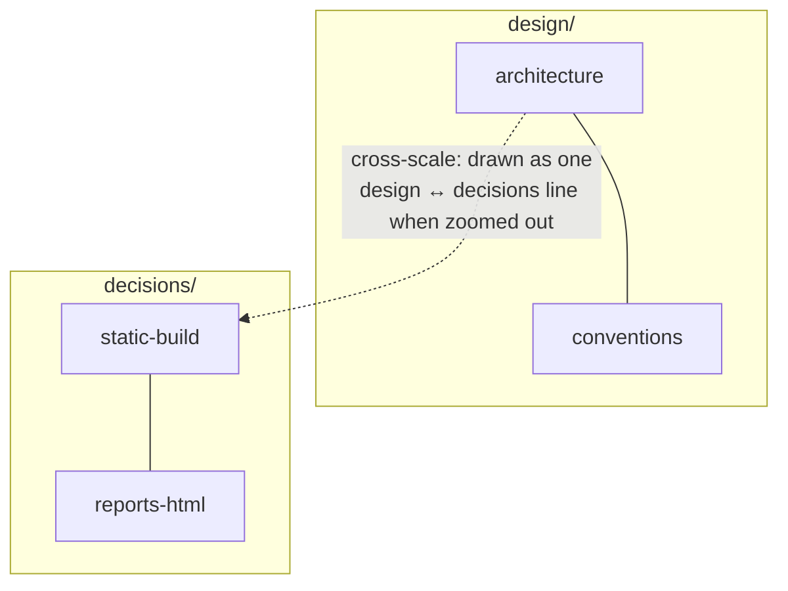

# Summary

From [characterising complexity](/ideas/manifesto/characterising-complexity.md):
the map is a hierarchy of networks ("nested networks"), and links between nodes
separated by nesting deserve separate examination from links within a community.

- A link **belongs** to the lowest folder containing both its ends. Siblings'
  links belong to their folder (within-community); links whose common folder is
  the root are cross-scale.
- **Draw a link at its scale.** Zoomed out, folders are bubbles joined by one
  line per pair, weighted by how many links it stands for. Zooming into a
  bubble opens it and shows its notes and internal links. Selecting a thick line
  lists the links it bundles. This is the tile-map analogy applied to edges.
- Cross-scale links are either insights into how parts connect or signs that
  the hierarchy is wrong.

The developer finds full hierarchical edge bundling (Holten, 2006) messy when
every edge is drawn; bundling only the edges above the current scale is the
variant worth trying. Nested stochastic block models (Peixoto) could compare
the drawn hierarchy with the one the links imply. Experimentation needed.

It uses data already in the bundle and is read-only, so it is the cheapest
first prototype.
