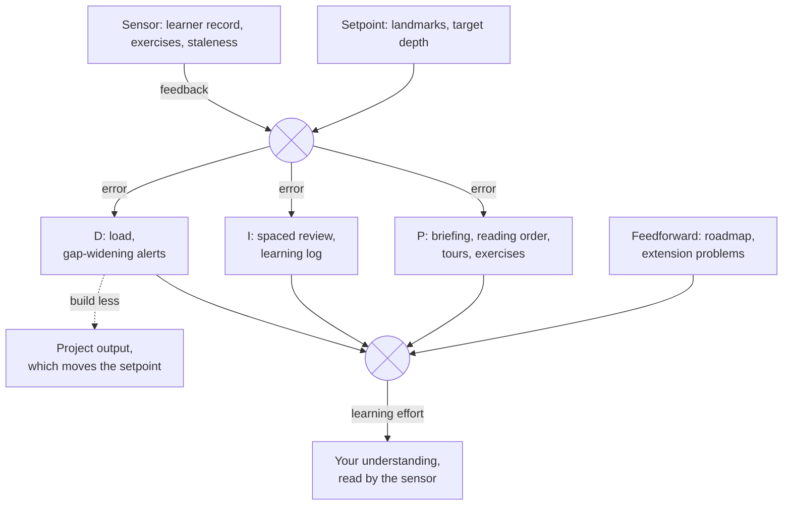

# Summary

The [motivation](/ideas/manifesto/motivation.md) models learning as a PID
controller. Taken seriously, the model sorts features and predicts failure
modes. Sensor features dominate, matching the observation that the error signal
is half the problem.

# Features by role

| Role | Features |
|---|---|
| **Sensor** (measuring the error) | the map as target; the [private learner record](/ideas/learning/learner-record.md); recall and explain-back exercises; "what changed since you last looked"; notes going stale when the resource they describe changes |
| **Setpoint** (what you aim for) | landmarks; a target depth per area, including "black box is fine" |
| **P** (the gap now) | catch-up briefing; reading order by gap × importance; [tours and exercises](/ideas/learning/tours-and-exercises.md) aimed at the largest gaps |
| **I** (the gap over time) | spaced review; persistent misconceptions surfaced gently; a learning log; anti-windup: a capped backlog |
| **D** (rate of change) | load indicator and break suggestion; gap-widening alert ("7 agent commits touched X since you last reviewed it"); smoothing so neither reacts to one data point |
| **Feedforward** | learning ahead of planned roadmap work; extension problems |
| **Plant-side lever** | the tool may recommend building less |

Presentation of these follows [professional mode](/ideas/learning/professional-mode.md).

# Notes on the control theory

Suggestions for the motivation note, left to the developer to adopt or not:

- **D damps; it does not overshoot.** A derivative term opposes rapid change in
  the error and reduces overshoot. Burnout mitigation fits D. Getting a head
  start on coming complexity is **feedforward**: acting on a known future
  disturbance (the roadmap) before the error appears.
- **P-only steady-state error is exact here.** A proportional controller settles
  where its push balances a constant disturbance; competing demands are that
  disturbance.
- **The setpoint is a ramp.** Complexity keeps growing, and P alone lags a
  moving target.
- **Integral windup** is the overdue-review pile that makes people quit; cap the
  backlog.
- **D amplifies sensor noise.** Measured understanding is noisy (one bad quiz,
  rereading that feels like understanding), so smooth before reacting.
- **Two levers.** Raise understanding, or slow the setpoint by building less.
