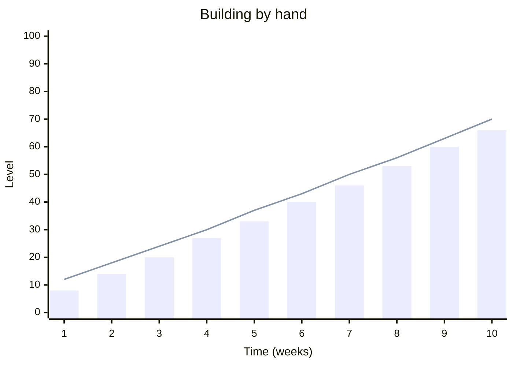
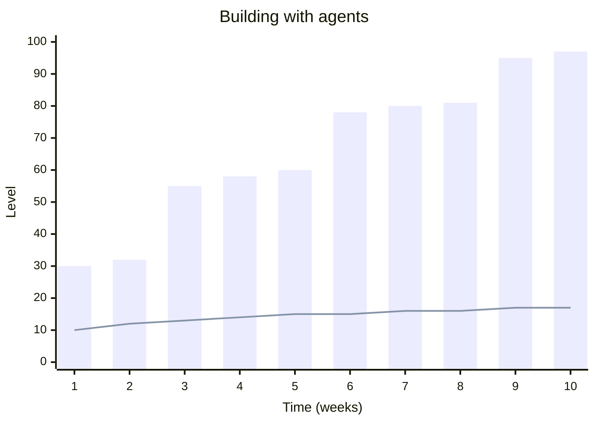
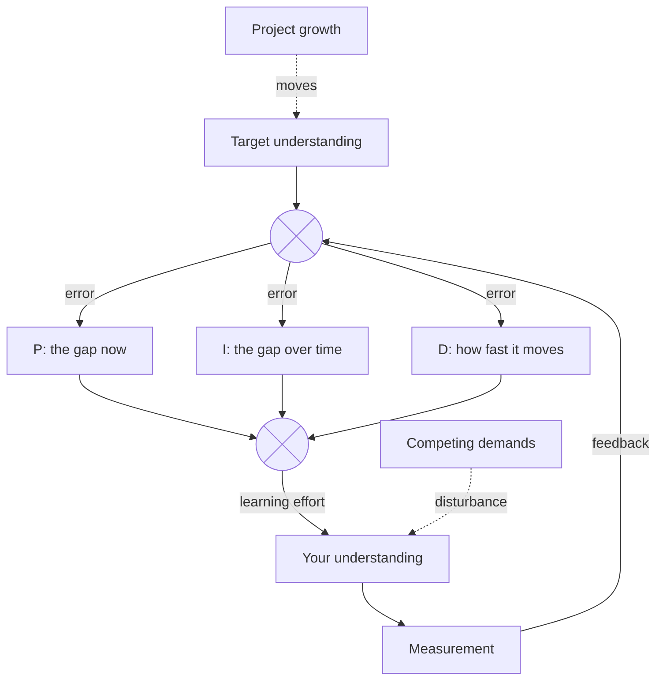

---

The purpose of this project is to bring the velocity of human understanding in line with the velocity of code development. Think of it as the equivalent of a PID controller, ensuring that you allocate energy towards understanding before getting ahead of yourself.

# Scenario

You come up with an idea for a project. You come up with a detailed spec outlining all the features you want and perhaps some suggestions for the actual mechanics of the implementation. You feed it to an agentic system which builds your project. Suddenly, there it is. 

However, now you have ~1000s of lines of code that you do not understand. It's so daunting that you never bother trying to understand. 

You ask your agent to fix some bugs and add some features and the complexity of the project continues to grow, completely untethered to your understanding of *how it actually works*.

This leaves you with the uneasy feeling of not truly understanding something that you should. It's worrying and frightening, and this might come back to bite you.

With this power at our fingertips we are rapidly trying to run before we can walk in areas of expertise that we are not experts in and do not undergo traditional training for. This is leaving human individuals burned out and lost.

The "PID" in PID controller stands for "Proportional Integral Derivative". They are used frequently in engineering contexts to control a certain output towards a desired target in a smooth and stable manner. 

My analogy is that the "certain output" we need to control is our understanding, and the "target" is a level of understanding commensurate with the complexity and status of a given project. 

We haven't needed one until now due to an implicit law:

> One must understand how something works in order to build it

For better or for worse, the advent of LLMs has weakened this law into something more specific:

> One must only understand the desired outcome in order to build it

This lack of understanding has a variety of adverse effects:

- Vulnerability through technical debt

- A lack of a sense of reward for having understood something

- A lack of a foundation upon which to build more sophisticated things

Therefore we need to devote time to building our understanding.

# A PID Controller for Understanding

In the past, project complexity and understanding have moved in lockstep, with understanding in fact moving just ahead of complexity before the project catches up. Now we are in a completely different paradigm, where complexity takes massive jumps ahead of our understanding, and understanding doesn't move. In both charts below, the bars are the project's complexity and the line is the builder's understanding.

## The error term (*knowing what you are up against*)

A PID controller is only as good as the error signal to the target it is trying to achieve. This is half the complexity of this tool. In order to gauge the error, you need to know how much remains to learn, and get an estimate of what you currently know.

The tool needs to:

> - Provide you with a picture of the knowledge you seek to obtain
> - Track and understand your level of understanding

## The three terms, summarised:

| Term | Takes into Account | Desired Behaviour |
| -- | -- | -- |
| **P**: Proportional | Existing level of understanding | Showing up |
| **I**: Integral | Historical level of understanding | Consistency; Reward-driven engagement |
| **D**: Derivative | Rate of learning | Planning; Extension; Burnout mitigation |

## Proportional (*the bulk work*)

The proportional term of a PID controller is the one which responds directly to the existing gap to the target. In this context, this means showing up to handle the broad strokes of the knowledge you need to ascertain.

However, in PID controller theory, it is well known that the proportional term alone is not enough. The proportional term is only enough to make you learn while the desire to reduce the gap is greater than the desire to do other things, such as advance the project, or just be lazy. As such, PID controllers with only the P term active inevitably fall short of fully reducing the error. Other things are required to help keep learning ticking over, and the next most important is the integral term.

## Integral (*maintenance*)

The integral term of a PID controller takes into account the past accumulation of error integrated over time. Where the proportional term stays constant, due to reaching the aforementioned equilibrium, the integral term actually grows with time. This helps cover the remaining 20% of the work. This is especially true of learning because that remaining 20% can take the most effort to crystallize. The individual is most likely to learn the 80% of things that come easy to them as an individual, with the remaining 20% being those randomly misconceived along the way. 

The integral term is the most time conscious of the three terms. The proportional and derivative terms care only about the present instantaneous status of your learning and understanding. The integral term cares about the characteristics of your learning process retrospectively.

In this context, this means acknowledging the finer details of the knowledge you still need to gain (that extra 20% the proportional term can't motivate you for). It also means observing your learning over time (like spaced-repetition). It also means providing a reward system that trains you to come back in the future (the longer you go without it, the stronger the craving gets).

## Derivative (*getting ahead*, *knowing when to stop*)

The derivative term *anticipates* future changes in the gap. Learning (reducing the gap) makes this term negative, while progress on the project (widening the gap) makes it positive.

This manifests in a duality of practical purposes for this tool. The first is preventing burnout. Learning takes effort. If you advance your learning too quickly, then you risk overexerting yourself. This will lead to you associating negative feelings towards the act of learning. In the tool, this should manifest as a subtle suggestion to acknowledge when progress has been made, and take a break. This could be measured by filling some form of learning quota.

The important thing is that it is not the time spent learning that should be taken as the amount of effort put in, it should be the amount of learning actually achieved, otherwise the reward gets conflated with simply spending raw time, which could be ineffective.

The other corollary of the derivative term of a PID controller is that it can help overshoot the target, which is productive in certain conditions. If the gap suddenly widens, then the derivative term expects it to widen again soon, so even when the gap zeroes, it continues to head in that direction. If the gap widens again, then through the earlier overshooting, some of the work needed to reduce the updated gap is already done. In practice, this looks like planning ahead for future developments on your project, and getting a headstart on the learning required to deal with that new complexity. This can also come in the form of extension problems, which probe concepts outside of what your project requires.

